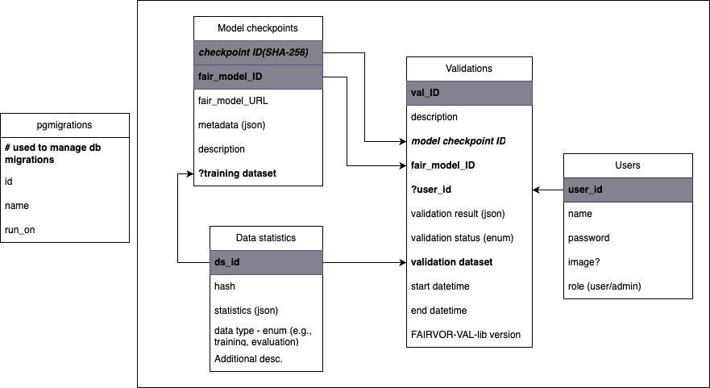

# FAIRmodels-validator Dashboard

FAIRmodels-validator Dashboard is a web application that allows users to validate their FAIRmodels.

Architecture


Database schema


## Docker Setup

This project includes Docker configuration for easy deployment and development. Follow these steps to run the application using Docker:

### Prerequisites
- Docker installed on your system
- Docker Compose installed on your system

### Environment Setup

1. Create a `.env` file in the root directory:
```bash
cp dashboard/_example .env dashboard/.env
```

2. Update the `.env` file with your desired configuration:
- Generate an AUTH_SECRET using: `npx auth secret`
- Modify database credentials if needed (default values are secure for local development)

### Development Environment

1. Start the development environment:
```bash
docker compose up
```

This will:
- Start the PostgreSQL database
- Run database migrations automatically
- Install dependencies
- Start the development server with hot-reload
- The application will be available at `http://localhost:5173`

2. (Optional) Seed the database with sample data:
```bash
docker compose run seed
```

### Production Deployment

For production deployment, use the production Docker Compose file:

```bash
docker compose -f docker-compose.prod.yml up
```

This will:
- Start the PostgreSQL database
- Run database migrations
- Build and start the production-optimized application
- The application will be available at `http://localhost:3000`

Key differences in production:
- Uses production-optimized Node.js build
- Runs on port 3000 instead of 5173
- Includes health checks for both database and frontend
- No sample data seeding available
- No hot-reload (changes require rebuild)

### Managing the Application

Stop the application:
```bash
# Development
docker compose down

# Production
docker compose -f docker-compose.prod.yml down
```

View logs:
```bash
# All services
docker compose logs

# Specific service
docker compose logs postgres
docker compose logs frontend
```

Remove volumes (deletes database data):
```bash
docker compose down -v
```

### Production Considerations

For production deployment:
1. Ensure your `.env` file contains secure credentials
2. Consider using Docker secrets for sensitive data
3. Use a reverse proxy (like Nginx) for SSL termination
4. Configure appropriate firewall rules
5. Set up regular database backups

### HTTPS Requirements

The application requires HTTPS in production for authentication to work properly:
- Required for Google OAuth authentication
- Necessary for secure JWT token transmission
- Required by Auth.js for production environments

You have two options to implement HTTPS:

1. Using a reverse proxy (recommended):
   - Configure Nginx or similar to handle SSL termination
   - Forward requests to the application
   - Handles certificates management

2. Direct HTTPS configuration:
   Add to your production .env:
   ```env
   PROTOCOL_HEADER=x-forwarded-proto
   HOST_HEADER=x-forwarded-host
   ```
